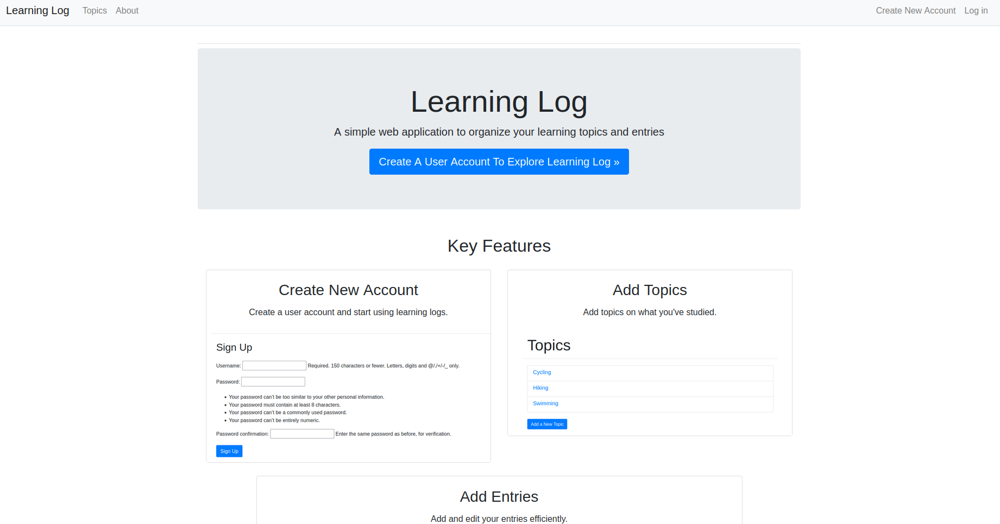

ALX Foundation Portfolio Project_Learning Log

Welcome to the Django Learning Log Project! This is a web application designed to help you organize and track your learning journey effectively. Inspired by the methods outlined in *Python Crash Course* by Eric Matthes, which provided valuable insights and examples that guided the development of this application. The application allows you to log your learning topics and entries in one centralized space.

This project was developed as part of my portfolio for Holberton School, demonstrating my skills in building full-stack web applications and creating functional, user-centric solutions using Django.

## Table of Contents
- [Project Landing Page](#project-landing-page)
- [Features](#features)
- [Technologies Used](#technologies-used)
- [Setup and Installation](#setup-and-installation)
- [Usage](#usage)
- [Project Timeline](#project-timeline)
- [Author](#author)

## Project Landing Page

The Learning Log application is live and accessible online everywhere. You can visit the project landing page here:

[Project Landing Page](https://alx-learning-log-c9e00c5290dd.herokuapp.com/landing_page/)

## Features

- Log learning topics and entries in a centralized space.
- Organize notes and insights by categories.
- User-friendly web interface.
- Ability to track learning progress over time.

## Technologies Used

- Django 5.0.4
- Django Bootstrap4
- Django Heroku
- Gunicorn
- SQLite

## Setup and Installation

To set up and run the project locally, follow these steps:

1. Clone the repository:

    
    git clone [https://github.com/Paree2512/LearningLog.git]
    
    cd LearningLog
    

2. Create a virtual environment (optional but recommended):

    
    python3 -m venv venv
    source venv/bin/activate
    

3. Install project dependencies:

    
    pip install -r requirements.txt
    

4. Set up the Django application:

    - Navigate to the project's root directory.
    - Run the migrations:

        
        python manage.py migrate
        

5. Run the development server:

    
    python manage.py runserver
    

The application should now be running locally at http://127.0.0.1:8000/.

## Usage

- Navigate to the web application using a web browser.
- Register a new user or log in with your credentials.
- Create, view, and manage your learning topics and entries.
- Explore the various features available in the application to track and organize your learning journey.

## Project Timeline

The development of the Django Learning Log project took approximately 3 weeks.

## Author

- Benjamin Semevor
    - [LinkedIn](https://www.linkedin.com/in/benjamin-semevor-1762395a/)
    - [Twitter](https://twitter.com/BenSemsGh)

Thank you for checking out the Django Learning Log Project! Feel free to reach out with any questions or feedback.